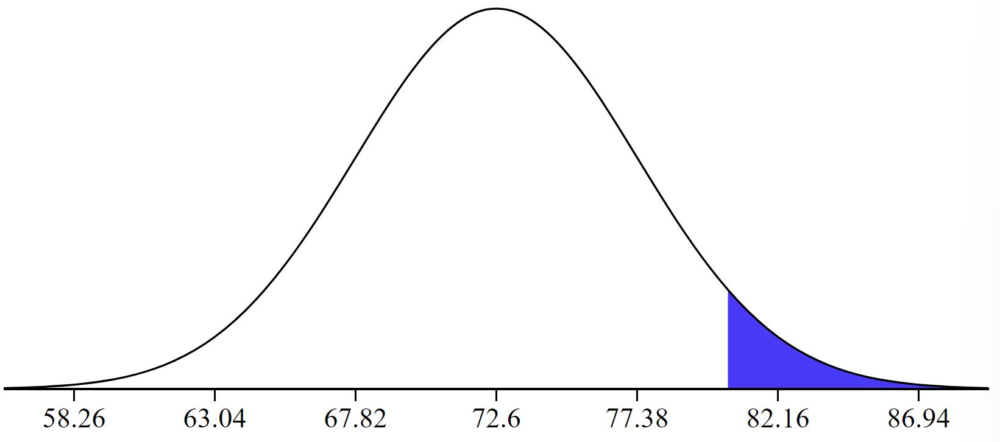

```{r setup, include=FALSE}
knitr::opts_chunk$set(echo = TRUE, warning = FALSE, message = FALSE)
```

*Make sure to write your answers in complete sentences.*

*Keep in mind the more work you show the more partial credit you can receive. If you only put the final answer and it is wrong, we do not know what you did to get there so we can't award partial credit.*


**Question 1**  
What percent of a standard normal distribution, $N(\mu = 0, \sigma = 1)$, is found in each region? For each: 

- sketch the distribution (i.e. draw the normal curve centered at the mean) and indicate what area we are looking for
- write out the `R` code you used to calculate the area
- calculate the percentage of the distribution that lies in that region

**(a)** Z > -1.13  

*(a) Solution:*

```{r, echo = FALSE, out.width = "0.3\\linewidth", include = TRUE}

```

```{r, echo = TRUE}
1 - pnorm(-1.13, mean = 0, sd = 1)
```

87.08% of the area in a standard normal curve is above Z = -1.13.


**(b)** Z < 0.18

*(b) Solution:*

```{r, echo = FALSE, out.width = "0.3\\linewidth", include = TRUE}

```

```{r, echo = TRUE}
pnorm(0.18, mean = 0, sd = 1)
```

57.14% of the area in a standard normal curve is below Z = 0.18.

**(c)** Z > 8

*(c) Solution:*

```{r, echo = FALSE, out.width = "0.3\\linewidth", include = TRUE}

```

```{r, echo = TRUE}
1 - pnorm(8, mean = 0, sd = 1)
```

Approximately 0% of the area in a standard normal curve is above Z = 8.

**(d)** |Z| < 0.5

*(d) Solution:*

```{r, echo = FALSE, out.width = "0.3\\linewidth", include = TRUE}

```

```{r, echo = TRUE}
pnorm(0.5, mean = 0, sd = 1) - pnorm(-0.5, mean = 0, sd = 1)
```

Approximately 38.29% of the area in a standard normal curve is between -0.15 and 0.15.


**Question 2**

The distribution of passenger vehicle speeds traveling on the Interstate 5 Freeway (I-5) in California is nearly normal with a mean of 72.6 miles/hour and a standard deviation of 4.78 miles/hour.

**(a)** What percent of passenger vehicles travel slower than 80 miles/hour?

*(a) Solution:*

```{r, echo = FALSE, out.width = "0.3\\linewidth", include = TRUE}

```

```{r, echo = TRUE}
pnorm(80, mean = 72.6, sd = 4.78)
```

93.92% of passenger vehicles travel slower than 80 miles/hour on the I-5.

**(b)** What percent of passenger vehicles travel between 60 and 80 miles/hour?

*(b) Solution:*

```{r, echo = FALSE, out.width = "0.3\\linewidth", include = TRUE}

```

```{r, echo = TRUE}
pnorm(80, mean = 72.6, sd = 4.78) - pnorm(60, mean = 72.6, sd = 4.78)
```

93.50% of passenger vehicles travel between 60 and 80 miles/hour on the I-5.

**(c)** How fast do the fastest 5% of passenger vehicles travel?

*(c) Solution:*

```{r, echo = FALSE, out.width = "0.3\\linewidth", include = TRUE}

```

```{r, echo = TRUE}
qnorm(1 - 0.05, mean = 72.6, sd = 4.78)
```

The fastest 5% of passenger vehicles on the I-5 travels 80.46 miles/hour or more.

**(d)** The speed limit on this stretch of the I-5 is 70 miles/hour. Approximate what percentage of the passenger
vehicles travel above the speed limit on this stretch of the I-5.

*(d) Solution:*

```{r, echo = FALSE, out.width = "0.3\\linewidth", include = TRUE}

```

```{r, echo = TRUE}
1 - pnorm(70, mean = 72.6, sd = 4.78)
```

70.68% of passenger vehicles travel above the speed limit of 70 miles/hour on this stretch of the I-5.


**Question 3**

Heights of 10 year olds, regardless of gender, closely follow a normal distribution with mean 55 inches and standard deviation 6 inches. The height requirement for Batman the Ride at Six Flags Magic Mountain is 54 inches. 

**(a)** What percent of 10 year olds cannot go on this ride?

*(a) Solution:*

```{r, echo = FALSE, out.width = "0.3\\linewidth", include = TRUE}

```

```{r, echo = TRUE}
pnorm(54, mean = 55, sd = 6)
```

43.38% of 10 year olds cannot go on this ride because they are shorter than 54 inches.

**(b)** Say engineers were thinking of putting a limit on the maximum height of a passenger. If the limit was 6 feet (72 inches), what percent of 10 year olds would not be able to ride?

*(b) Solution:*

```{r, echo = FALSE,out.width = "0.3\\linewidth", include = TRUE}

```

```{r, echo = TRUE}
pnorm(72, mean = 55, sd = 6) - pnorm(54, mean = 55, sd = 6)
```

56.39% of 10 year olds cannot go on this ride because they are shorter than 54 inches or taller than 72 inches.


**Question 4**

For each of the following situations, state whether the parameter of interest is a mean or a proportion.

**(a)** A poll shows that 64% of Americans personally worry a great deal about federal spending and the budget
deficit.

*(a) Solution:*

Whether or not they worry about federal spending is a categorical variable with two levels, so this is looking at the proportion.

**(b)** A survey reports that local TV news has shown a 17% increase in revenue within a two year period
while newspaper revenues decreased by 6.4% during this time period.

*(b) Solution:*

The percent change in revenue is a numerical value so we would be looking at the mean.

**(c)** In a survey, high school and college students are asked whether or not they use geolocation services on
their phones.

*(c) Solution:*

Whether or not they use geolocation services on their phone is a categorical variable so we would be looking at proportion.

**(d)** In a survey, smart phone users are asked whether or not they use a web-based taxi service.

*(d) Solution:*

Whether or not they use a web-based taxi service is a categorical variable so we would be looking at proportion.

**(e)** In a survey, smart phone users are asked how many times they used a web-based taxi service over the
last year.

*(e) Solution:*

The number of times used is a discrete numerical variable so we would look at the mean number of times used.


**Question 5**

In a random sample 765 adults in the United States, 322 say they could not cover a $400 unexpected expense without borrowing money or going into debt.

**(a)** What population is under consideration in the data set?

*(a) Solution:*

Here we are considering adults in the United States.

**(b)** What parameter is being estimated?

*(b) Solution:*

We want to estimate the proportion of US adults who could not cover a $400 unexpected expense without borrowing money or going into debt.

**(c)** What is the point estimate for the parameter?

*(c) Solution:*

The point estimate is the sample proportion.

**(d)** What is the name of the statistic we use to measure the uncertainty of the point estimate?

*(d) Solution:*

The uncertainty of a point estimate is the standard error.

**(e)** Compute the value from part (d) for this context.

*(e) Solution:*

The standard error is computed as:
$$SE = \sqrt{\frac{p(1-p)}{n}} \approx \sqrt{\frac{\hat{p}(1-\hat{p})}{n}} = \sqrt{\frac{(322/765)(1 - 322/765)}{765}}$$

```{r}
sqrt((322 / 765) * (1 - 322 / 765) / 765)
```

The standard error of our point estimate is 0.0178.

**(f)** A cable news pundit thinks the value is actually 50%. Should she be surprised by the data?

*(f) Solution:*

```{r}
(322 / 765) + 0.0178
```

Yes she should be surprised because 50% is more than 2 standard deviations above the sample proportion (this is called the rule of thumb).


**(g)** Suppose the true population value was found to be 40%. If we use this proportion to recompute the
value in part (e) using p = 0.4 instead of $\hat{p}$, does the resulting value change much?

*(g) Solution:*

The standard error would be computed as:
$$SE = \sqrt{\frac{p(1-p)}{n}} = \sqrt{\frac{0.4 (1 - 0.4)}{765}}$$

```{r}
sqrt(0.4 * (1 - 0.4) / 765)
```

The standard deviation with p = 0.4, 0.0177, is very close to that for the sample proportion, 0.0178. 


**Question 6**

Of all freshman at a large college, 16% made the dean’s list in the current year. As part of a class project, students randomly sample 40 students and check if those students made the list. They repeat this 1,000 times and build a distribution of sample proportions.

**(a)** What is this distribution called?

*(a) Solution:*

The distribution is called the sampling distribution.

**(b)** Would you expect the shape of this distribution to be symmetric or skewed? Explain your reasoning.

*(b) Solution:*

```{r}
40 * .16
```

np equals 6.4 which does not meet the success failure requirement of 10 or more, so the Central Limit Theorem does not apply and so I would expect the distribution to be skewed. 

**(c)** Calculate the variability of this distribution.

*(c) Solution:*

The standard error is computed as:
$$SE = \sqrt{\frac{p(1-p)}{n}} \approx \sqrt{\frac{\hat{p}(1-\hat{p})}{n}} = \sqrt{\frac{0.16 (1 - 0.16)}{40}}$$

```{r}
sqrt(0.16 * (1 - 0.16) / 40)
```

The standard error of our point estimate is 0.0580.

**(d)** Suppose the students decide to sample again, this time collecting 90 students per sample, and they again
collect 1,000 samples. They build a new distribution of sample proportions. How will the variability
of this new distribution compare to the variability of the distribution when each sample contained 40
observations?

*(d) Solution:*

The increased the sample size so the new sampling distribution should be closer to a normal distribution than the original sampling distribution.


**Question 7**

A poll conducted in 2013 found that 52% of U.S. adult Twitter users get at least some news on Twitter. The standard error for this estimate was 2.4%, and a normal distribution may be used to model the sample proportion. Construct a 99% confidence interval for the fraction of U.S. adult Twitter users who get some news on Twitter, and interpret the confidence interval in context.

*Solution:*

We are told the distribution is approximately normal so we calculate the confidence interval as
$$\hat{p} \pm Z^* \times SE$$

We need to find $Z^*$ for 99% confidence level so we use `qnorm()`.

```{r}
qnorm((1 - 0.99) / 2, mean = 0, sd = 1)
```

Now we know our $\hat{p}$ is 0.52, $Z^*$ is 2.58, and SE is 0.024. 

```{r}
0.52 - 2.57 * 0.024
```
```{r}
0.52 + 2.57 * 0.024
```

We are 99% confident that the proportion of U.S. adult Twitter users that get at least some news on Twitter is between 0.4583 and 0.5817.


**Question 8**

A poll conducted in 2013 found that 52% of U.S. adult Twitter users get at least some news on Twitter, and the standard error for this estimate was 2.4%. Identify each of the following statements as true or false. Provide an explanation to justify each of your answers.

**(a)** Since the standard error is 2.4%, we can conclude that 97.6% of all U.S. adult Twitter users were
included in the study.

*(a) Solution:*

False, the standard error is the uncertainty of our sample proportion in estimating the population proportion.

**(b)** If we want to reduce the standard error of the estimate, we should collect less data.

*(b) Solution:*

False, decreasing our sample size will increase the standard error.

**(c)** If we construct a 90% confidence interval for the percentage of U.S. adults Twitter users who get
some news through Twitter, this confidence interval will be wider than a corresponding 99% confidence
interval.

*(c) Solution:*

False, as the confidence level increases our confidence interval gets wider.


**Question 9**
A store randomly samples 603 shoppers over the course of a year and finds that 142 of them made their visit because of a coupon they’d received in the mail. 

**(a)** Construct a 95% confidence interval for the fraction of all shoppers during the year whose visit was because of a coupon they’d received in the mail. Remember to check the conditions required to use a normal distribution for our point estimate.

*(a) Solution:*

First we need to check the conditions of independence and the success failure requirement. This is a random sample so we have independence. $np = 603 * (142 / 603) = 142 \geq 10$ and $n(1-p) = 603 * (1 - 142 / 603) = 461$. Thus both conditions are met so the CLT says the point estimate will be approximately normally distributed.

Now we need to identify the components of our confidence interval. $\hat{p} = 142/603$, $Z^*$ = 1.96, and $SE \approx \sqrt{\frac{\hat{p}(1-\hat{p})}{n}}$.

```{r}
142 / 603 - 1.96 * sqrt((142 / 603) * (1 - 142 / 603) / 603)
```

```{r}
142 / 603 + 1.96 * sqrt((142 / 603) * (1 - 142 / 603) / 603)
```

We are 95% confident that the proportion of shoppers in a year that made their visit because of a coupon they'd received in the mail is between 0.2016 and 0.2694.

**(b)** What does "95% confident" mean? Explain in the context of the application.

*(b) Solution:*
It means that 95% of samples collected from this population would have confidence intervals that contain the true proportion of yearly shoppers that visited because of a coupon they'd received in the mail.