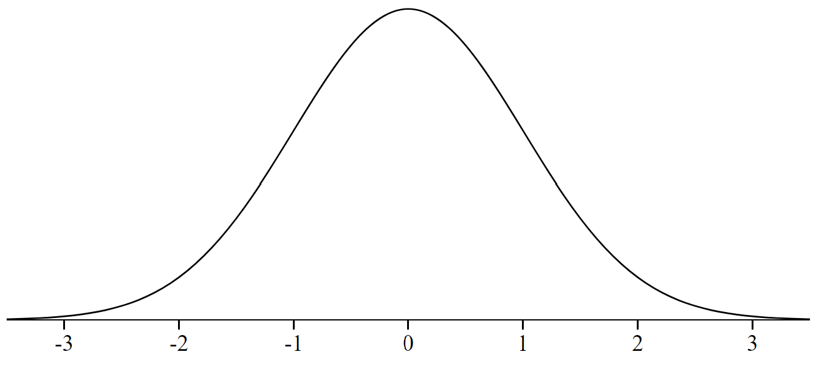

```{r setup, include=FALSE}
knitr::opts_chunk$set(
  echo = TRUE, 
  warning = FALSE, message = FALSE,
  fig.align = "center"
)
```

*Make sure to write your answers in complete sentences.*

*Keep in mind the more work you show the more partial credit you can receive. If you only put the final answer and it is wrong, we do not know what you did to get there so we can't award partial credit.*

When unspecified assume the significance level is 0.05.

### Question 1

A national survey conducted among a simple random sample of 1,507 adults shows that 56% of Americans think the Civil War is still relevant to American politics and political life.

**(a)** Conduct a hypothesis test to determine if these data provide strong evidence that the majority of the Americans think the Civil War is still relevant.

*Solution:*

Let p be the proportion of American adults that think the Civil War is still relevant to American politics and political life.

$H_0:$ p = 0.5  
$H_A:$ p > 0.5

n = 1507, $\hat{p} = 0.56$

test statistic:
$$Z = \frac{\hat{p} - p_0}{\sqrt{\frac{p_0 (1 - p_0)}{n}}}$$
```{r}
(0.56 - 0.5) / sqrt(0.5 * (1 - 0.5) / 1507)
```
So Z = 4.66, now we need the p-value. We are doing a one-tail test where we care about the area above our test statistic (because of our $H_A$).

```{r, echo = FALSE, out.width = "0.3\\linewidth", include = TRUE}

```

```{r}
1 - pnorm(4.66, mean = 0, sd = 1)
```

Our p-value is less than 0.0001. Since our p-value is less than the assumed significance of 0.05, we will reject the null hypothesis.

We found very strong evidence (p-value < 0.0001 < $\alpha$ = 0.05) that the majority of Americans think the Civil War is still relevant to American politics and political life.


**(b)** Interpret the p-value in this context.

*Solution:*

There is essentially a 0% probability of observing data as as or more extreme than what we observed, if only half of Americans think the Civil War is still relevant to American politics and political life.

**(c)** Calculate a 90% confidence interval for the proportion of Americans who think the Civil War is still relevant. Interpret the interval in this context, and comment on whether or not the confidence interval agrees with the conclusion of the hypothesis test.

*Solution:*

Formula for 90% confidence interval for a proportion:
$$\hat{p} \pm z^* \times \sqrt{\frac{\hat{p}(1 - \hat{p})}{n}}$$

First we need to obtain the $z^*$ value for a 90% confidence level:
```{r}
qnorm((1 - 0.9) / 2, mean = 0, sd = 1)
```

Now we can plug in our values
```{r}
0.56 - 1.64 * sqrt(0.56 * (1 - 0.56) / 1507)
```

```{r}
0.56 + 1.64 * sqrt(0.56 * (1 - 0.56) / 1507)
```

We are 95% confident that the proportion of Americans who think the Civil War is still relevant is between 0.5390 and 0.5810.

This confidence interval is completely above the value of 0.5, so it supports that a majority of Americans think the Civil War is still relevant, agreeing with the conclusion of the hypothesis test.
### Question 2

On June 28, 2012 the U.S. Supreme Court upheld the much debated 2010 healthcare law, declaring it constitutional. A Gallup poll released the day after this decision indicates that 46% of 1,012 Americans agree with this decision. At a 95% confidence level, this sample has a 3% margin of error. Based on this information, determine if the following statements are true or false, and explain your reasoning.

**(a)** We are 95% confident that between 43% and 49% of Americans in this sample support the decision of the U.S. Supreme Court on the 2010 healthcare law.

*Solution:*

False, confidence intervals are about propulation parameters, no sample statistics. We are actually 100% positive of the proportion of Americans in this sample that support the decision of the U.S. Supreme Court on the 2010 healthcare law, because we can directly compute it to be 46%.

**(b)** We are 95% confident that between 43% and 49% of Americans support the decision of the U.S. Supreme Court on the 2010 healthcare law.

*Solution:*

True, this is a perfect interpretation of the confidence interval.

**(c)** If we considered many random samples of 1,012 Americans, and we calculated the sample proportions of those who support the decision of the U.S. Supreme Court, 95% of those sample proportions will be between 43% and 49%.

*Solution:*

False, the confidence interval is not about a sample proportion its about a population proportion.

**(d)** The margin of error at a 90% confidence level would be higher than 3%.

*Solution:*

False, as we decrease the confidence level we decrease the margin of error, obtaining a narrower confidence interval.


### Question 3

It is believed that large doses of acetaminophen (the active ingredient in over the counter pain relievers like Tylenol) may cause damage to the liver. A researcher wants to conduct a study to estimate the proportion of acetaminophen users who have liver damage. For participating in this study, he will pay each subject $20 and provide a free medical consultation if the patient has liver damage.

**(a)** If he wants to limit the margin of error of his 98% confidence interval to 2%, what is the minimum number of subjects he needs in the study?

*Solution:*

We know the formula for the margin of error for a confidence interval for a proportion:
$$ME = z^* \times \sqrt{\frac{\hat{p}(1 - \hat{p})}{n}}$$

We need to calculated $z^*$ for a 98% confidence level.

```{r}
qnorm((1 - 0.98) / 2, mean = 0, sd = 1)
```

We don't have a historic study to use for $\hat{p}$ so we will use a value of 0.5.

Now we can set the formula for the margin of error less than or equal to 2%, plug in our values, and solve for n.

\begin{equation*}
  \begin{split}
    0.02 &\geq ME\\
    0.02 &\geq 2.33 \times \sqrt{\frac{0.5 * (1 - 0.5)}{n}}\\
    0.02^2 &\geq 2.33^2 \times \frac{0.5 * (1 - 0.5)}{n}\\
    n &\geq 2.33^2 \times \frac{0.5 * (1 - 0.5)}{0.02^2}\\
    n &\geq 3393.062
  \end{split}
\end{equation*}

To have a 2% margin of error for a 98% confidence interval for the proportion of acetaminophen users who have liver damage, the researcher has to sample a minimum of 2294 people.

**(b)** The amount of money he would need for the sample size you calculated in part (a) is substantially over his budget so he decides to use fewer subjects. How will this affect the width of his confidence interval?

*Solution:*

Deceasing the sample size will increase the width of the confidence interval.


### Question 4
According to a report on sleep deprivation by the Centers for Disease Control and Prevention, the proportion of California residents who reported insufficient rest or sleep during each of the preceding 30 days is 8.0%, while this proportion is 8.8% for Oregon residents. These data are based on simple random samples of 11,545 California and 4,691 Oregon residents. 

**(a)** Calculate a 95% confidence interval for the difference between the proportions of Californians and Oregonians who are sleep deprived and interpret it in context of the data. List the conditions that should be checked.

*Solution:*

We have: $n_C = 11545$, $n_O = 4691$, $\hat{p}_{C} = 0.08$, $\hat{p}_O = 0.088$, and $z^* = 1.96$. 

The formula for a confidence interval for the difference of two proportions is:
$$(\hat{p}_C - \hat{p}_O) \pm z^* \times \sqrt{\frac{\hat{p}_C(1-\hat{p}_C)}{n_C} + \frac{\hat{p}_O(1-\hat{p}_O)}{n_O}}$$

```{r}
0.08 - 0.088 - 1.96 * sqrt(0.08 * (1 - 0.08) / 11545 + 0.088 * (1 - 0.088) / 4691)
```

```{r}
0.08 - 0.088 + 1.96 * sqrt(0.08 * (1 - 0.08) / 11545 + 0.088 * (1 - 0.088) / 4691)
```

We are 95% confidence that the difference in proportion of California and Oregon residents who reported insufficient rest or sleep is between -0.0175 and 0.0015.

**(b)** Perform a hypothesis test to investigate if there is evidence of a difference in proportion at a significance level of 0.05. Conclude in the context of the study. List the conditions for this hypothesis test.

*Solution:*

$H_0: p_C - p_O = 0$ There is no difference in proportion of California and Oregon residents who report insufficient rest or sleep. 

$H_A: p_C - p_O \ne 0$ There is a difference in proportion of California and Oregon residents who report insufficient rest or sleep. 

Independence within and between samples and the pooled proportion would need to satisfy the success failure conditions.

To calculate our test statistic we need the pooled proportion which is the total number of successes over the total number of failures.
```{r}
(11545 * 0.08 + 4691 * 0.088) / (11545 + 4691)
```

Now we can calculate the test statistic with $\hat{p}_{pooled}$ in place of p's in the standard error.

```{r}
(0.08 - 0.088) / sqrt(0.0823 * (1 - 0.0823) / 11545 + 0.0823 * (1 - 0.0823) / 4691)
```

Now we calculate the two-sided p-value:
```{r}
2 * pnorm(-1.68, mean = 0, sd = 1)
```

We did not find evidence (p-value = 0.0930 > $\alpha$ = 0.05) of a difference in proportions bewteen California and Oregon residents who report insufficient rest or sleep. 


### Question 5

Microhabitat factors associated with forage and bed sites of barking deer in Hainan Island, China were examined. In this region woods make up 4.8% of the land, cultivated grass plot makes up 14.7%, and deciduous forests make up 39.6%. Of the 426 sites where the deer forage, 4 were categorized as woods, 16 as cultivated grassplot, and 61 as deciduous forests. The table below summarizes these data.

| Woods | Cultivated grassplot | Deciduous forests | Other | Total |
|-------|----------------------|-------------------|----- |-------|
| 4 | 16 | 61 | 345 | 426 |

**(a)** Write the hypotheses for testing if barking deer prefer to forage in certain habitats over others.

*Solution:*

$H_0:$ Barking deer have no preference between habitats when foraging.

$H_A:$ Barking deer have a preference between habitats when foraging.

**(b)** What type of test can we use to answer this research question?

*Solution:*

Chi square test for goodness of fit would be appropriate.

**(c)** Calculate the expected number deer foraging events for each site type, under the null hypothesis.

*Solution:*

The total number of sites is 426 and there are 4 types of sites so if there were no preference we would expect 426 / 4 = 106.5 in each cell.

**(d)** Check if the assumptions and conditions required for this test are satisfied.

*Solution:*

I wouldn't think a deer foraging at one site type would influence another deer so we will conclude independence. The expected cell counts are all 106.5 which is well above 5.


**(e)** Do these data provide convincing evidence that barking deer prefer to forage in certain habitats over others? Conduct an appropriate hypothesis test to answer this research question.

*Solution:*

We need to calculate the test statistic by calculating $(\text{observed} - \text{expected})^2/\text{expected}$ for each cell of the table, and then sum up these values.
```{r}
(4 - 106.5)^2 / 106.5 + (16 - 106.5)^2 / 106.5 + (61 - 106.5)^2 / 106.5 + (345 - 106.5)^2 / 106.5 
```
The degrees of freedom is the number of cells minus 1 so 3.

The p-value is calculated as the area above the test statistic, under the chi square distribution curve with 3 degrees of freedom

```{r}
1 - pchisq(729.10, df = 3)
```
This p-value is essentially 0.

We found extremely strong evidence (p-value $\approx$ 0) that the barking deer in Hainan Isaland, China have a foraging site type preference.

### Question 6

A Gallup poll surveyed 18-29 year Americans about their employment status and whether or not they have diabetes. The survey results are in the contingency table below.

|             | Employed | Not Employed | Total  |
|:------------|:---------|:-------------|:-------|
| Diabetes    | 717      | 146          | 863    |
| No Diabetes | 47,057   | 5,709        | 52,766 |
| Total       | 47,774   | 5,855        | 53,629 |

**(a)** State appropriate hypotheses to test for difference in proportions of diabetes between employed and unemployed Americans.

*Solution:*

$H_0:$ There is no association between 18-29 year old Americans' employment status and having diabetes.

$H_A:$ There is an association between 18-29 year old Americans' employment status and having diabetes.

**(b)** The sample difference is about 1%. If we completed the hypothesis test, we would find that the p-value is very small (about 0), meaning the difference is statistically significant. Use this result to explain the difference between statistically significant and practically significant findings.

*Solution:*

We were able to find strong evidence of a difference between the observed cell counts and the expected ones (statistical significance), but this difference is actually very small, 1%, so it is not a meaningful difference (not practically significant).


### Question 7

Researchers conducted a study investigating the relationship between caffeinated coffee consumption and risk of depression in women. They collected data on 50,739 women free of depression symptoms at the start of the study in the year 1996, and these women were followed through 2006. The researchers used questionnaires to collect data on caffeinated coffee consumption, asked each individual about physician-diagnosed depression, and also asked about the use of antidepressants. The table below shows the distribution of incidences of depression by amount of caffeinated coffee consumption.

```{r, echo = FALSE, out.width = "0.8\\linewidth", include = TRUE}
knitr::include_graphics("hw3-question5-table.png")
```

**(a)** What type of test is appropriate for evaluating if there is an association between coffee intake and depression?

*Solution:*

The chi square test for independence is appropriate for testing for an association between two categorical variables.

**(b)** Write the hypotheses for the test you identified in part (a).

*Solution:*

$H_0:$ There is no association between caffeinated coffee consumption and clinical depression for women.

$H_A:$ There is an association between caffeinated coffee consumption and clinical depression for women.

**(c)** Calculate the overall proportion of women who do and do not suffer from depression.

*Solution:*

The proportion of women who do suffer from depression is the row total for "yes" over the table total, 2607 / 50739. 

The proportion of women who do not suffer from depression is the row total for "no" over the table total, 48132 / 50739.

**(d)** Identify the expected count for the highlighted cell, and calculate the contribution of this cell to the test statistic, i.e. $\frac{(\text{Observed} - \text{Expected})^2}{\text{Expected}}$.

*Solution:*

The expected value for this cell is the row total for "yes" times the column total for "2-6 cups/week" divided by the table total.

```{r}
2607 * 6617 / 50739
```

$\frac{(\text{Observed} - \text{Expected})^2}{\text{Expected}} = \frac{(\text{373} - \text{339.99})^2}{\text{339.99}}$ 

```{r}
(373 - 339.99)^2 / 339.99
```

This cell's contribution to the test statistic is 3.20.

**(e)** The test statistic is $\chi^2 = 20.93$. What is the p-value?

*Solution:*

We need to determine the degrees of freedom first. 
df = (number of rows - 1) x (number of columns - 1) = (5 - 1) x (2 - 1) = 4.

Now we need to calculate the area above 20.93 under a chi square distribution with 4 degrees of freedom.

```{r}
1 - pchisq(20.93, df = 4)
```

The p-value is 0.0003.

**(f)** What is the conclusion of the hypothesis test?

*Solution:*

We found very strong evidence (p-value = 0.0003 < $\alpha$ = 0.0) that there is an association between caffeinated coffee consumption and clinical depression in women.

**(g)** One of the authors of this study was quoted on the NYTimes as saying it was "too early to recommend that women load up on extra coffee" based on just this study. Do you agree with this statement? Explain your reasoning.

*Solution:*

Yes, it is was too early because that study was observational so causal conclusions cannot be made.