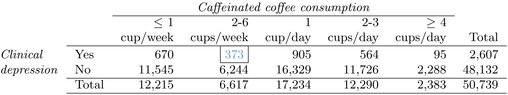

```{r setup, include=FALSE}
knitr::opts_chunk$set(
  echo = TRUE, 
  warning = FALSE, message = FALSE,
  fig.align = "center"
)
```

0.6 points per part.

*Make sure to write your answers in complete sentences.*

*Keep in mind the more work you show the more partial credit you can receive. If you only put the final answer and it is wrong, we do not know what you did to get there so we can't award partial credit.*

When unspecified assume the significance level is 0.05.

### Question 1

A national survey conducted among a simple random sample of 1,507 adults shows that 56% of Americans think the Civil War is still relevant to American politics and political life.

**(a)** Conduct a hypothesis test to determine if these data provide strong evidence that the majority of the Americans think the Civil War is still relevant.

**(b)** Interpret the p-value in this context.

**(c)** Calculate a 90% confidence interval for the proportion of Americans who think the Civil War is still relevant. Interpret the interval in this context, and comment on whether or not the confidence interval agrees with the conclusion of the hypothesis test.

### Question 2

On June 28, 2012 the U.S. Supreme Court upheld the much debated 2010 healthcare law, declaring it constitutional. A Gallup poll released the day after this decision indicates that 46% of 1,012 Americans agree with this decision. At a 95% confidence level, this sample has a 3% margin of error. Based on this information, determine if the following statements are true or false, and explain your reasoning.

**(a)** We are 95% confident that between 43% and 49% of Americans in this sample support the decision of the U.S. Supreme Court on the 2010 healthcare law.

**(b)** We are 95% confident that between 43% and 49% of Americans support the decision of the U.S. Supreme Court on the 2010 healthcare law.

**(c)** If we considered many random samples of 1,012 Americans, and we calculated the sample proportions of those who support the decision of the U.S. Supreme Court, 95% of those sample proportions will be between 43% and 49%.

**(d)** The margin of error at a 90% confidence level would be higher than 3%.

### Question 3

It is believed that large doses of acetaminophen (the active ingredient in over the counter pain relievers like Tylenol) may cause damage to the liver. A researcher wants to conduct a study to estimate the proportion of acetaminophen users who have liver damage. For participating in this study, he will pay each subject $20 and provide a free medical consultation if the patient has liver damage.

**(a)** If he wants to limit the margin of error of his 98% confidence interval to 2%, what is the minimum number of subjects he needs in the study?


**(b)** The amount of money he would need for the sample size you calculated in part (a) is substantially over his budget so he decides to use fewer subjects. How will this affect the width of his confidence interval?


### Question 4
According to a report on sleep deprivation by the Centers for Disease Control and Prevention, the proportion of California residents who reported insufficient rest or sleep during each of the preceding 30 days is 8.0%, while this proportion is 8.8% for Oregon residents. These data are based on simple random samples of 11,545 California and 4,691 Oregon residents. 

**(a)** Calculate a 95% confidence interval for the difference between the proportions of Californians and Oregonians who are sleep deprived and interpret it in context of the data. List the conditions that should be checked.


**(b)** Perform a hypothesis test to investigate if there is evidence of a difference in proportion at a significance level of 0.05. Conclude in the context of the study. List the conditions for this hypothesis test.


### Question 5

Microhabitat factors associated with forage and bed sites of barking deer in Hainan Island, China were examined. In this region woods make up 4.8% of the land, cultivated grass plot makes up 14.7%, and deciduous forests make up 39.6%. Of the 426 sites where the deer forage, 4 were categorized as woods, 16 as cultivated grassplot, and 61 as deciduous forests. The table below summarizes these data.

| Woods | Cultivated grassplot | Deciduous forests | Other | Total |
|-------|----------------------|-------------------|----- |-------|
| 4 | 16 | 61 | 345 | 426 |

**(a)** Write the hypotheses for testing if barking deer prefer to forage in certain habitats over others.

**(b)** What type of test can we use to answer this research question?

**(c)** Calculate the expected number deer foraging events for each site type, under the null hypothesis.

**(d)** Check if the assumptions and conditions required for this test are satisfied.

**(e)** Do these data provide convincing evidence that barking deer prefer to forage in certain habitats over others? Conduct an appropriate hypothesis test to answer this research question.

### Question 6

A Gallup poll surveyed 18-29 year Americans about their employment status and whether or not they have diabetes. The survey results are in the contingency table below.

|             | Employed | Not Employed | Total  |
|:------------|:---------|:-------------|:-------|
| Diabetes    | 717      | 146          | 863    |
| No Diabetes | 47,057   | 5,709        | 52,766 |
| Total       | 47,774   | 5,855        | 53,629 |

**(a)** State appropriate hypotheses to test for difference in proportions of diabetes between employed and unemployed Americans.

**(b)** The sample difference is about 1%. If we completed the hypothesis test, we would find that the p-value is very small (about 0), meaning the difference is statistically significant. Use this result to explain the difference between statistically significant and practically significant findings.

### Question 7

Researchers conducted a study investigating the relationship between caffeinated coffee consumption and risk of depression in women. They collected data on 50,739 women free of depression symptoms at the start of the study in the year 1996, and these women were followed through 2006. The researchers used questionnaires to collect data on caffeinated coffee consumption, asked each individual about physician-diagnosed depression, and also asked about the use of antidepressants. The table below shows the distribution of incidences of depression by amount of caffeinated coffee consumption.

```{r, echo = FALSE, out.width = "0.8\\linewidth", include = TRUE}

```

**(a)** What type of test is appropriate for evaluating if there is an association between coffee intake and depression?

**(b)** Write the hypotheses for the test you identified in part (a).

**(c)** Calculate the overall proportion of women who do and do not suffer from depression.

**(d)** Identify the expected count for the highlighted cell, and calculate the contribution of this cell to the test statistic, i.e. $\frac{(\text{Observed} - \text{Expected})^2}{\text{Expected}}$.

**(e)** The test statistic is $\chi^2 = 20.93$. What is the p-value?

**(f)** What is the conclusion of the hypothesis test?

**(g)** One of the authors of this study was quoted on the NYTimes as saying it was "too early to recommend that women load up on extra coffee" based on just this study. Do you agree with this statement? Explain your reasoning.
