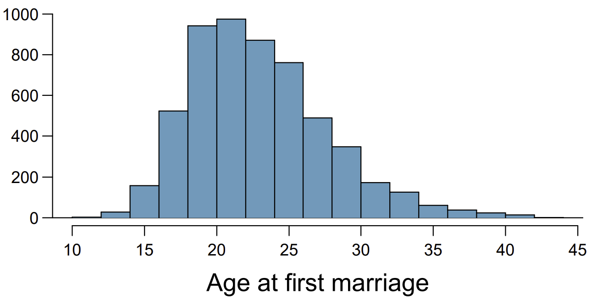
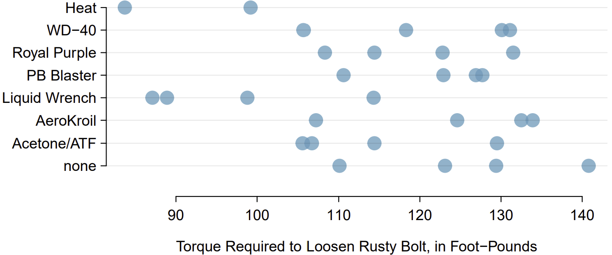
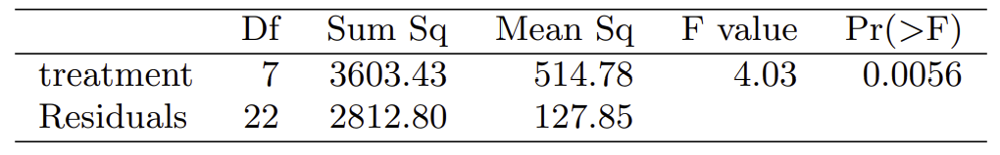
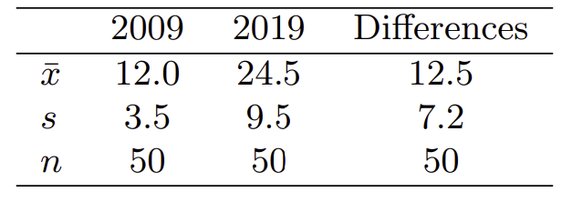

```{r setup, include=FALSE}
knitr::opts_chunk$set(
  echo = TRUE, 
  warning = FALSE, message = FALSE,
  fig.align = "center"
)
```

For each question:

- Identify the data type and therefore the type of inference.
- List the assumptions and if we have enough information / meet the conditions to proceed with the inference. Proceed with the analysis regardless.
- Assume the significance level is 0.05.


## Question 1

The National Survey of Family Growth conducted by the Centers for Disease Control gathers information on family life, marriage and divorce, pregnancy, infertility, use of contraception, and men's and women's health. One of the variables collected on this survey is the age at first marriage. The histogram below shows the distribution of ages at first marriage of 5,534 randomly sampled women between 2006 and 2010. The average age at first marriage among these women is 23.44 with a standard deviation of 4.72.

```{r, echo = FALSE, out.width = "0.6\\linewidth", include = TRUE}

```

Do these data provide strong evidence that the average age at first marriage of women is over 21?


## Question 2

Project Farm is a YouTube channel that routinely compares different products. In one episode, the channel evaluated different options for loosening rusty bolts. Eight options were evaluated, including a control group where no treatment was given ("none" in the graph), to determine which was most effective. For all treatments, there were four bolts tested, except for a treatment of heat with a blow torch, where only two data points were collected. The results are shown in the figure below:

```{r, echo = FALSE, out.width = "0.6\\linewidth", include = TRUE}

```

Describe hypotheses for ANOVA in this context, and use the table below to carry out the test. Give your conclusion in the context of the data.

```{r, echo = FALSE, out.width = "0.6\\linewidth", include = TRUE}

```


## Question 3

Researchers investigated the effects of being distracted by a game on how much people eat. They monitored food intake for a group of 44 patients who were randomized into two equal groups. The treatment group ate lunch while playing solitaire, and the control group ate lunch without any added distractions. The 22 patients in the treatment group who ate their lunch while playing solitaire were asked to do a serial-order recall of the food lunch items they ate. The average number of items recalled by the patients in this group was 4.9, with a standard deviation of 1.8. The average number of items recalled by the patients in the control group (no distraction) was 6.1, with a standard deviation of 1.8. Do these data provide strong evidence that the average number of food items recalled by the patients in the treatment and control groups are different?


## Question 4

Forest rangers wanted to better understand the rate of growth for younger trees in the park. They took measurements of a random sample of 50 young trees in 2009 and again measured those same trees in 2019. The data below summarize their measurements, where the heights are in feet:

```{r, echo = FALSE, out.width = "0.6\\linewidth", include = TRUE}

```

Construct a 99% confidence interval for the average growth of (what had been) younger trees in the park over 2009-2019.