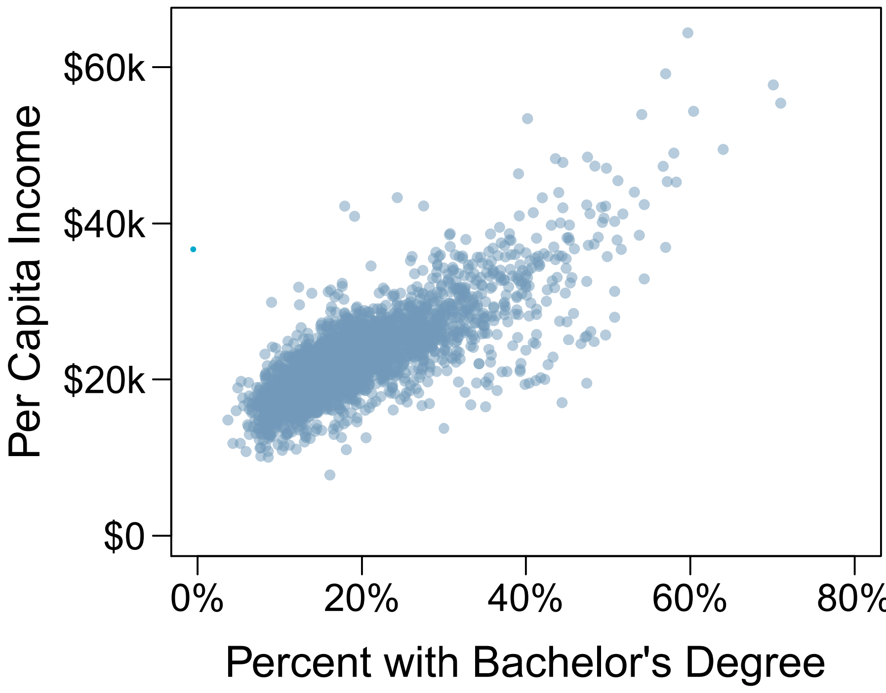
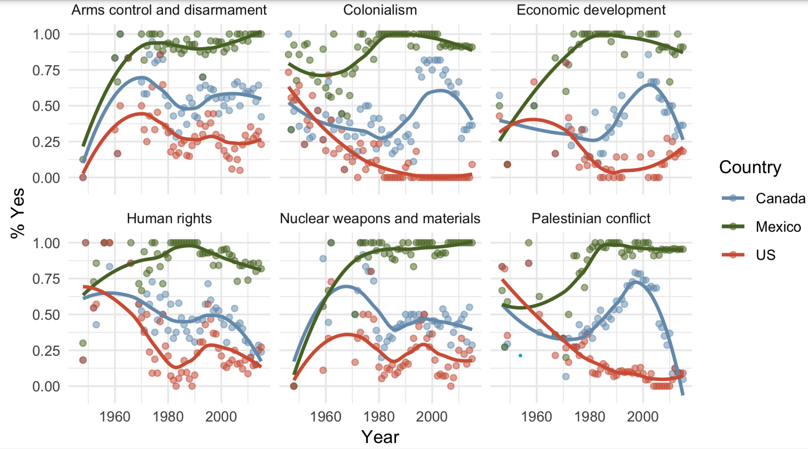
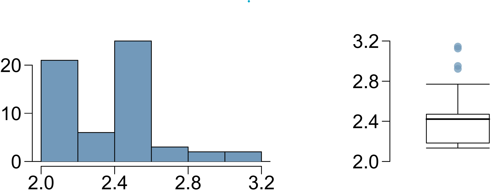
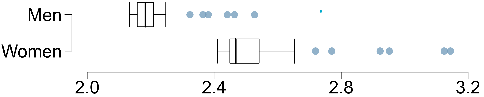
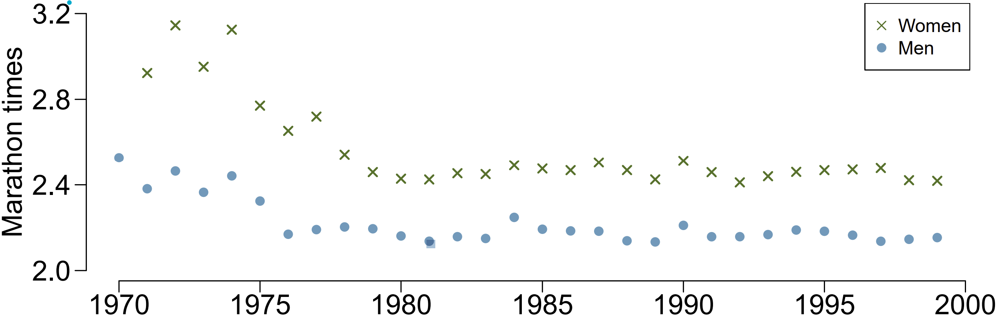

```{r setup, include=FALSE}
knitr::opts_chunk$set(
  echo = FALSE,
  message = FALSE,
  warning = FALSE
)
```

**Question 1.**  

In a study evaluating the relationship between stress and muscle cramps, half the subjects are randomly assigned to be exposed to increased stress by being placed into an elevator that falls rapidly and stops abruptly and the other half are left at no or baseline stress.

**(a)** What type of study is this?

*(a) Solution:*

This study assigned participants randomly to either the treatment or control group. The use of assignment makes this study an experiment.

**(b)** Can this study be used to conclude a causal relationship between increased stress and muscle cramps?

*(b) Solution:*

Yes, the use of random assignment allows for causal conclusions.

**Question 2.**

A city council has requested a household survey be conducted in a suburban area of their city. The area is broken into many distinct and unique neighborhoods, some including large homes, some with only apartments, and others a diverse mixture of housing structures. For each part below, identify the sampling methods described.

**(a)** Divide the city into 20 neighborhoods, randomly sample 3 neighborhoods, and then sample all households from those 3 neighborhoods.

*(a) Solution:*

Cluster sample

**(b)** Divide the city into 20 neighborhoods, and sample 10 households from each neighborhood.

*(b) Solution:*

Stratified sample

**(c)** Divide the city into 20 neighborhoods, randomly sample 8 neighborhoods, and then randomly sample 50 households from those neighborhoods.

*(c) Solution:*

Multistage sample

**(d)** Randomly sample 200 households from the city.

*(d) Solution:*

Simple random sample


**Question 3.**

The scatterplot below shows the relationship between per capita income (in thousands of dollars) and percent of population with a bachelor’s degree in 3,143 counties in the US in 2010.


```{r, out.width="0.4\\linewidth", fig.align="center"}

```

**(a)** What are the explanatory and response variables?

*(a) Solution:*  

The explanatory variable is the percent of the county's population with a bachelor's degree. The response variable is the county's per capita income in thousands of dollars.

**(b)** Describe the relationship between the two
variables. Make sure to discuss unusual observations, if any.

*(b) Solution:*

There appears to be a positive linear association between these variables.

**(c)** Can we conclude that having a bachelor’s
degree increases one’s income?

*(c) Solution:*

No, there is no assignment so this is an observational study. Causal conclusions cannot be drawn from an observational study because of possible confounding.


**Question 4.**

In a study of three nationally representative large scale data sets from Ireland, the United States, and the United Kingdom (n = 17,247), teenagers between the ages of 12 to 15 were asked to keep a diary of their screen time and answer questions about how they felt or acted. The answers to these questions were then used to compute a psychological well-being score. The study concluded that there is little clear-cut evidence that screen time decreases adolescent well-being.

**(a)** Identify the main research question of the study.

*(a) Solution:*

Either of these answers are appropriate:

- Does screen time decrease adolescent psychological well-being for adolescents? 
- Is there an association between screen time and adolescent psychological well-being?

**(b)** Who are the subjects in this study, and how many are included?

*(b) Solution:*

17,247 adolescents from Ireland, the United States, and the United Kingdom between the ages of 12 to 15.

**(c)** What type of study is this?

*(c) Solution:* 

The researchers did not assign the amount of screen time for participants so this was an observational study.

**(d)** Identify the explanatory variable.

*(d) Solution:*  

Child's screen time.

**(e)** Identify the response variable.

*(e) Solution:*  

Child's psychological well-being score computed from questions about how the child felt or acted.

**(f)** Comment on whether the results of the study can be generalized and why. If the results can be generalized, specify to what population.

*(f) Solution:*  

Yes, this study used a representative sample of 12-15 year old teenagers in Ireland, the United States, and the United Kingdom. Since that is the population the sample is representative of, that is the population the results can be generalized to.

**(g)** Comment on whether the results of the study can be used to establish causal relationships

*(g) Solution:*  

This is an observational study so causal conclusions cannot be made.


**Question 5.**

An excerpt from an article published in the *NY Times* titled *The School Bully Is Sleepy* states the following:

"The University of Michigan study, collected survey data from parents on each child's sleep habits and asked both parents and teachers to assess behavioral concerns. About a third of the students studied were identified by parents or teachers as having problems with disruptive behavior or bullying. The researchers found that children who had behavioral issues and those who were identified as bullies were twice as likely to have shown symptoms of sleep disorders."

**(a)** A friend of yours who read the article says, "The study shows that sleep disorders lead to bullying in school children." Is this statement justified? If not, how best can you describe the conclusion that can be drawn from this study?

*(a) Solution *  

No, this statement is not correct based on this article because there was not assignment of sleep disorders, making it an observational study and preventing a causal conclusion. The study found evidence of an association between children with behavioral issues and an increased chance of a child showing symptoms of sleep disorders.


**Question 6**  

Suppose you want to estimate the percentage of videos on YouTube that are cat videos. It is impossible for you to watch all videos on YouTube so you use a random video picker to select 1000 videos for you. You find that 2% of these videos are cat videos. Determine which of the following is an observation, a variable, a sample statistic (value calculated based on the observed sample), or a population parameter.

**(a)** Percentage of all videos on YouTube that are cat videos.

*(a) Solution: *  

Population parameter

**(b)** 2%.

*(a) Solution: *  

Sample statistic

**(c)** A video in your sample.

*(a) Solution: *  

Observation

**(d)** Whether or not a video is a cat video

*(a) Solution: *  

Variable


**Question 7**

The visualization below shows voting patterns in the United States, Canada, and Mexico in the United Nations General Assembly on a variety of issues. Specifically, for a given year between 1946 and 2015, it displays the percentage of roll calls in which the country voted yes for each issue. This visualization was constructed based on a dataset where each observation is a country/year pair.

```{r, out.width="0.8\\linewidth", fig.align="center"}

```

**(a)** List the 4 variables used in creating this visualization. 

*(a) Solution:*  

The variables are country, year, issue voted on, and percentage of roll calls in which the country voted yes.

**(b)** Indicate whether each variable in the study is numerical or categorical. If numerical, identify as continuous or discrete. If categorical, indicate if the variable is ordinal.

*(b) Solution:*  

Country is a regular categorical variable with 3 levels. Year is a discrete numerical variable. Issue is a regular categorical variable with 6 levels. Percent where they voted yes is a continuous numerical variable.


**Question 8**  

The histogram and box plots below shoe the distribution of finishing times for male and female winners of the New York Marathon between 1970 and 1999.
```{r, out.width="0.5\\linewidth", fig.align="center"}

```

**(a)** Comment on the modality and skewness of the distribution of finishing times. Note which plot you used to make these observations.

*(a) Solution:*  

The histrogram shows this distribution is bimodal and right skewed.

**(b)** Identify the approximate median and which plot provided this information.

*(b) Solution:*

The box plot shows the median winning finishing time is approximately 2.4.

**(c)** Compare the center and spread of the distribution of marathon times for men and women based on the box plot shown below.

```{r, out.width="0.5\\linewidth", fig.align="center"}

```

*(c) Solution:*

The median and IQR of the running times for men are smaller than that for the women. The center and spread of the running time distribution is smaller for men than for women.

**(d)** The time series plot shown below is another way to look at these data. Describe what is visible in this plot but not in the others.

```{r, out.width="0.5\\linewidth", fig.align="center"}

```

*(d) Solution:*

In each year the New York Marathon's female winner's finishing time was longer than the male winner's time. Also, the winner times generally decreased between 1970 and 1977 then remained fairly consistent.


**Question 9**

Facebook data indicate that 50% of Facebook users have 100 or more friends, and that the average friend count of users is 190.

**(a)** What is the median number of Facebook friends a user has?

*(a) Solution:*

100

**(b)** Based on the mean and median do you think the distribution of Facebook friends a user has is skewed? If so, in what direction?

*(b) Solution:*

Yes, the mean is almost double the median. This suggest the data is right skewed because the mean is closer to the tail than the median in skewed distributions.

**(c)** What measure of the center and spread of the distribution should be used for skewed data?

*(c) Solution:*

The median and IQR should be used for skewed data.