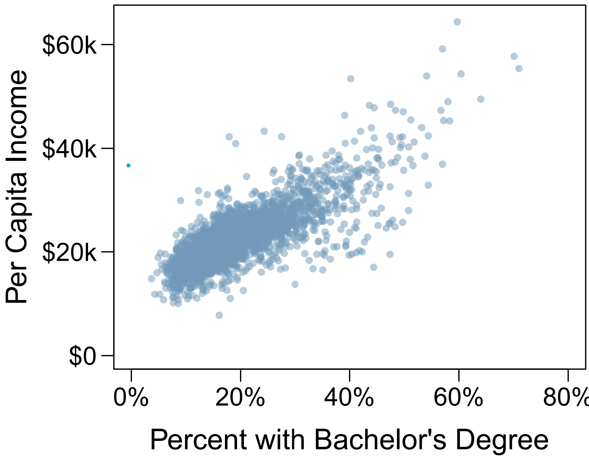
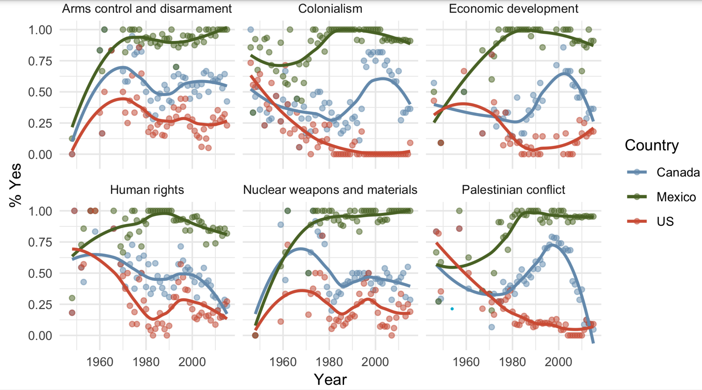
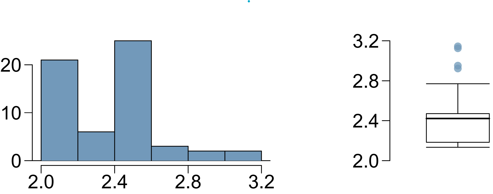
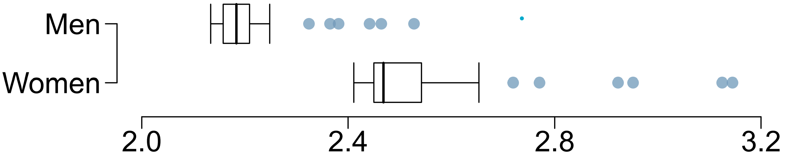
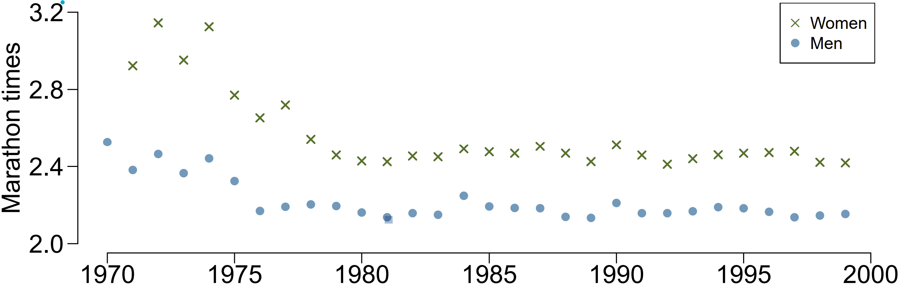

```{r setup, include=FALSE}
knitr::opts_chunk$set(
  echo = FALSE,
  message = FALSE,
  warning = FALSE
)
```

**Question 1.**  

In a study evaluating the relationship between stress and muscle cramps, half the subjects are randomly assigned to be exposed to increased stress by being placed into an elevator that falls rapidly and stops abruptly and the other half are left at no or baseline stress.

**(a)** What type of study is this?

**(b)** Can this study be used to conclude a causal relationship between increased stress and muscle cramps?


**Question 2.**

A city council has requested a household survey be conducted in a suburban area of their city. The area is broken into many distinct and unique neighborhoods, some including large homes, some with only apartments, and others a diverse mixture of housing structures. For each part below, identify the sampling methods described.

**(a)** Divide the city into 20 neighborhoods, randomly sample 3 neighborhoods, and then sample all households from those 3 neighborhoods.

**(b)** Divide the city into 20 neighborhoods, and sample 10 households from each neighborhood.

**(c)** Divide the city into 20 neighborhoods, randomly sample 8 neighborhoods, and then randomly sample 50 households from those neighborhoods.

**(d)** Randomly sample 200 households from the city.


**Question 3.**

The scatterplot below shows the relationship between per capita income (in thousands of dollars) and percent of population with a bachelor’s degree in 3,143 counties in the US in 2010.

```{r, out.width="0.4\\linewidth", fig.align="center"}

```

**(a)** What are the explanatory and response variables?

**(b)** Describe the relationship between the two
variables. Make sure to discuss unusual observations, if any.

**(c)** Can we conclude that having a bachelor’s
degree increases one’s income?


**Question 4.**

In a study of three nationally representative large scale data sets from Ireland, the United States, and the United Kingdom (n = 17,247), teenagers between the ages of 12 to 15 were asked to keep a diary of their screen time and answer questions about how they felt or acted. The answers to these questions were then used to compute a psychological well-being score. The study concluded that there is little clear-cut evidence that screen time decreases adolescent well-being.

**(a)** Identify the main research question of the study.

**(b)** Who are the subjects in this study, and how many are included?

**(c)** What type of study is this?

**(d)** Identify the explanatory variable.

**(e)** Identify the response variable.

**(f)** Comment on whether the results of the study can be generalized and why. If the results can be generalized, specify to what population.

**(g)** Comment on whether the results of the study can be used to establish causal relationships


**Question 5.**

An excerpt from an article published in the *NY Times* titled *The School Bully Is Sleepy* states the following:

"The University of Michigan study, collected survey data from parents on each child's sleep habits and asked both parents and teachers to assess behavioral concerns. About a third of the students studied were identified by parents or teachers as having problems with disruptive behavior or bullying. The researchers found that children who had behavioral issues and those who were identified as bullies were twice as likely to have shown symptoms of sleep disorders."

**(a)** A friend of yours who read the article says, "The study shows that sleep disorders lead to bullying in school children." Is this statement justified? If not, how best can you describe the conclusion that can be drawn from this study?


**Question 6**  

Suppose you want to estimate the percentage of videos on YouTube that are cat videos. It is impossible for you to watch all videos on YouTube so you use a random video picker to select 1000 videos for you. You find that 2% of these videos are cat videos. Determine which of the following is an observation, a variable, a sample statistic (value calculated based on the observed sample), or a population parameter.

**(a)** Percentage of all videos on YouTube that are cat videos.

**(b)** 2%.

**(c)** A video in your sample.

**(d)** Whether or not a video is a cat video


**Question 7**

The visualization below shows voting patterns in the United States, Canada, and Mexico in the United Nations General Assembly on a variety of issues. Specifically, for a given year between 1946 and 2015, it displays the percentage of roll calls in which the country voted yes for each issue. This visualization was constructed based on a dataset where each observation is a country/year pair.

```{r, out.width="0.8\\linewidth", fig.align="center"}

```

**(a)** List the 4 variables used in creating this visualization. 

**(b)** Indicate whether each variable in the study is numerical or categorical. If numerical, identify as continuous or discrete. If categorical, indicate if the variable is ordinal.


**Question 8**  

The histogram and box plots below shoe the distribution of finishing times for male and female winners of the New York Marathon between 1970 and 1999.
```{r, out.width="0.5\\linewidth", fig.align="center"}

```

**(a)** Comment on the modality and skewness of the distribution of finishing times. Note which plot you used to make these observations.

**(b)** Identify the approximate median and which plot provided this information.

**(c)** Compare the center and spread of the distribution of marathon times for men and women based on the box plot shown below.

```{r, out.width="0.5\\linewidth", fig.align="center"}

```

**(d)** The time series plot shown below is another way to look at these data. Describe what is visible in this plot but not in the others.

```{r, out.width="0.5\\linewidth", fig.align="center"}

```


**Question 9**

Facebook data indicate that 50% of Facebook users have 100 or more friends, and that the average friend count of users is 190.

**(a)** What is the median number of Facebook friends a user has?

**(b)** Based on the mean and median do you think the distribution of Facebook friends a user has is skewed? If so, in what direction?

**(c)** What measure of the center and spread of the distribution should be used for skewed data?
